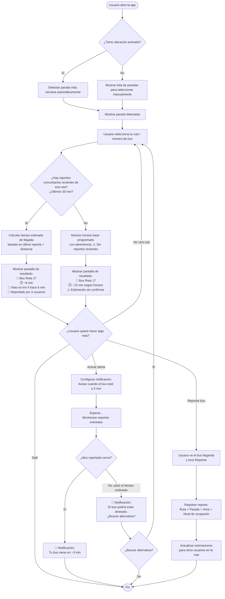

# Diagrama de flujo — Feature: "¿Viene mi bus?"

> **Estudiante:** Emerson Tahay — 202308012  
> **Feature:** Consulta de tiempo estimado de llegada del próximo bus a tu parada  
> **Dolor que ataca:** Marco no sabe si el bus ya pasó o viene en camino (F2 del mapa de recorrido)  
> **Cita ancla:** "No hay app que te diga dónde va el bus. Uno se aprende los horarios a puro golpe."

---

## Descripción de la feature

El usuario abre la app, selecciona su parada y ruta, y ve el tiempo estimado de llegada del próximo bus. La estimación se alimenta de **reportes comunitarios**: otros usuarios reportan cuando ven o abordan un bus, y el sistema calcula la posición aproximada. Si no hay reportes recientes, la app muestra el horario base con una advertencia de baja confianza.

---

## Diagrama de flujo

---

## Flujo resumido en pasos

| Paso | Acción del usuario | Respuesta del sistema |
|---|---|---|
| 1 | Abre la app | Detecta ubicación o muestra lista de paradas |
| 2 | Selecciona parada y ruta | Busca reportes comunitarios recientes |
| 3 | — | Si hay reportes: muestra ETA con confianza alta. Si no: muestra horario base con advertencia |
| 4 | (Opcional) Activa alerta | Le avisa cuando el bus esté a ~5 min según reportes |
| 5 | (Opcional) Reporta bus | Alimenta el sistema para otros usuarios |
| 6 | (Si hay atraso) Busca alternativa | Muestra otras rutas disponibles |

---

## Conexión con el problema definido

| Elemento del S03 | Cómo lo resuelve esta feature |
|---|---|
| **Job:** "Quiero tener certeza de que voy a llegar sin contratiempos" | Le da información para tomar decisiones antes de quedarse varado |
| **Valle F4 (Imprevisto):** Bus no llega o se descompone | La alerta de atraso le permite buscar alternativa antes de perder tiempo |
| **Valle F2 (Parada):** Espera sin info | Reemplaza "un poste con un letrero" por un estimado de llegada |
| **Dolor:** "Uno se aprende los horarios a puro golpe" | Los reportes comunitarios dan info real, no solo horarios teóricos |
