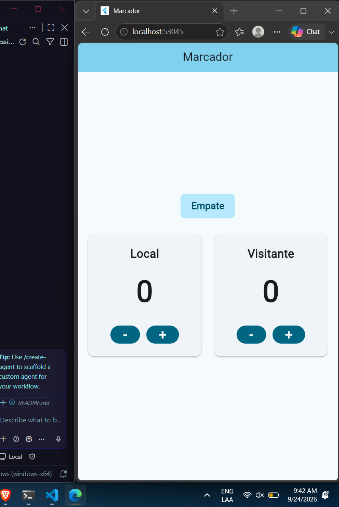

# Marcador

## Capturas

### Captura 1

 ¿Qué hace setState cuando presiona un botón y qué ocurriría si cambia los
puntos sin llamarlo?

Pues le dice a flutter que el widget cambio y tiene que redibujar, si no se hace internamente se cambio el valor pero no lo va a redibujar y por ende no se actualiza en la vista.